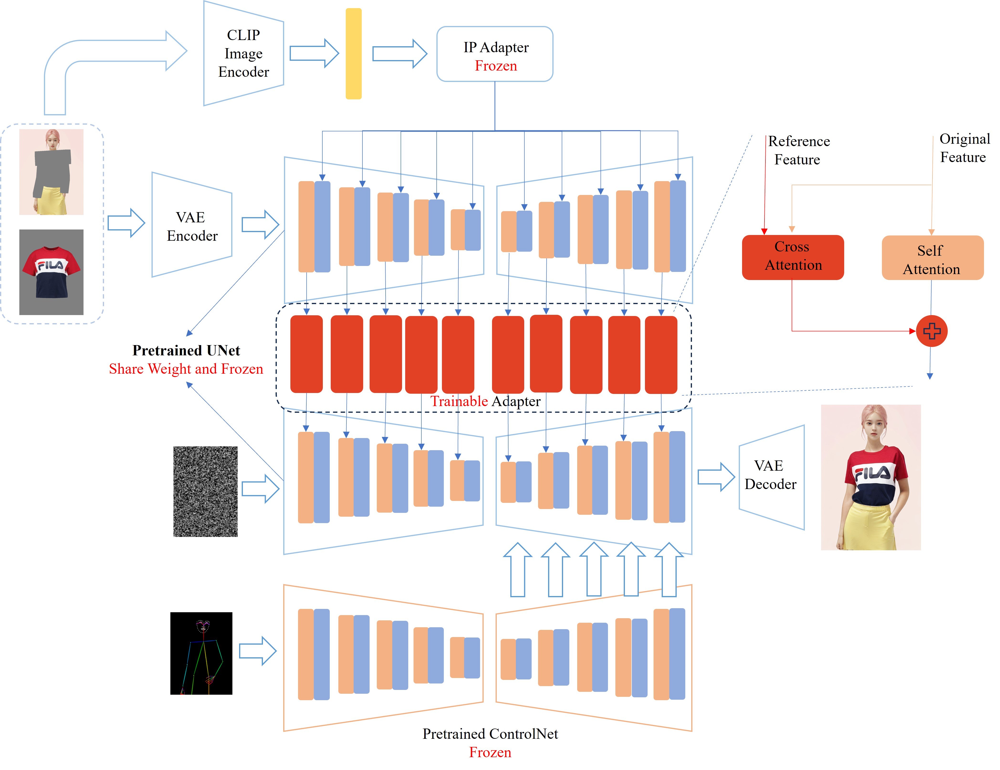

## EasyOOTD: Pose-Controllable Virtual Try-On via Diffusion Adapter

### Introduction
* Implemented virtual try-on with a new Adapter based on the SD1.5 model, only 198 MB in size, adaptable to different base models.
* Seamlessly integrates with pre-trained ControlNet, enabling pose-controllable virtual try-on.
* Trained an LCM-Lora specifically for this Adapter, only 76 MB in size, capable of inference in 4 steps.
* Designed a SAM-based interactive image segmentation webui, allowing users to easily specify the replacement area for virtual try-on.

**Note: This project was completed as a hobby in spare time. As it only adds one Adapter, the model's capabilities have limitations. If you apply it directly to products, you do so at your own risk.**

### Model Structure

### How to Use
* Environment setup
* Model download
* Running and usage tutorial

### About Me
Feel free to follow my video channel, where I'll continue to share my AIGC content. For collaboration inquiries, please send a private message.

