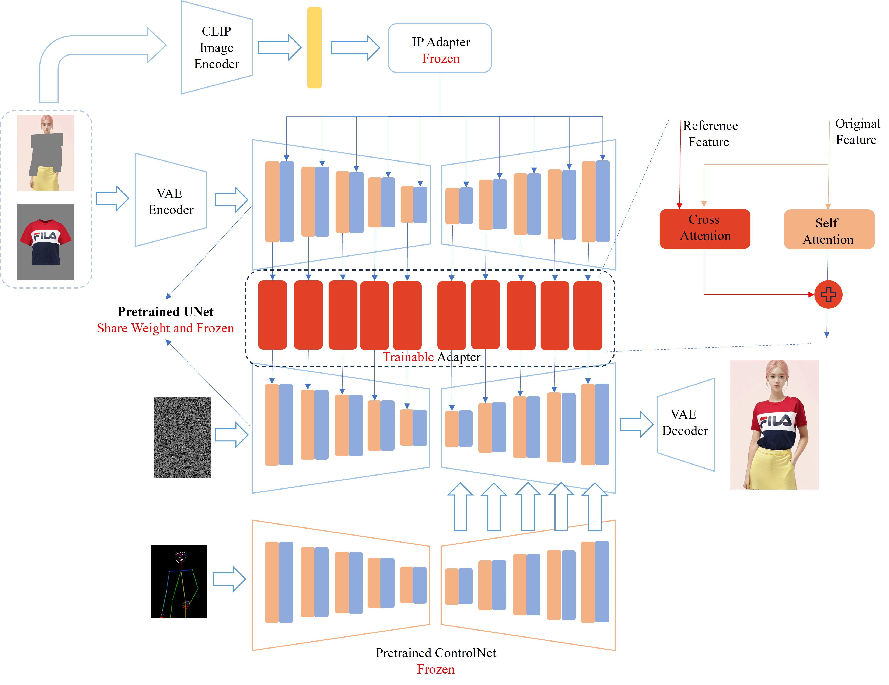

## EasyOOTD: 姿态可控的虚拟穿衣
<a href="README.md">English</a> | <a href="README_CN.md">中文</a>

### EasyOOTD的特色
* 基于SD1.5模型新增了一个Adapter实现虚拟穿衣, 大小只有198 MB，可适配不同的SD1.5基座模型。
* 无缝接入预训练好的ControlNet,实现姿态可控的虚拟穿衣。
* 针对该Adapter训练了一个LCM-Lora，大小只有76 MB，可在4步完成推理。
* 设计了一个基于[SAM-HQ](https://github.com/SysCV/sam-hq)的可交互式抠图的webui，方便用户自己指定虚拟穿衣的替换区域。

**注意：该项目是出于兴趣爱好在业余时间完成，因为只增加了一个Adapter，所以模型的能力有其局限性，如果你将它直接应用到产品，你将自己承担风险**

**如果你觉得这个项目有用，帮我点个star吧✨✨**

### Demo
<video src="https://github.com/user-attachments/assets/082ec10c-aa6a-4931-8229-ade11f3a8e2e" controls="controls" width="500" height="300">您的浏览器不支持播放该视频！</video>

### 模型结构

### 如何使用
* 环境安装
  * 安装python环境，可以使用[conda](https://github.com/conda-forge/miniforge)安装：`conda create -n easy_ootd python=3.10`, 然后`conda activate easy_ootd`
  * `pip install -e .`
  * 如果有GPU:
    * `conda install pytorch==2.3.0 torchvision==0.18.0 torchaudio==2.3.0 pytorch-cuda=12.1 -c pytorch -c nvidia`
    * `pip install onnxruntime-gpu`
    * `pip install -r requirements.txt`
  * 如果是CPU:
    * `conda install pytorch==2.3.0 torchvision==0.18.0 torchaudio==2.3.0 cpuonly -c pytorch`
    * `pip install onnxruntime`
    * `pip install -r requirements.txt`
* 模型下载: `bash scripts/download_models.sh`
* 运行: `python app.py`, 打开网页: `http://127.0.0.1:7865/`
* 使用教程：
<video src="https://github.com/user-attachments/assets/fe472102-7b0e-4f35-9292-b442a203ff09" controls="controls" width="500" height="300">您的浏览器不支持播放该视频！</video>

### 关于我
欢迎关注我的视频号，会持续分享我做的AIGC的内容。有合作需求欢迎私信。

